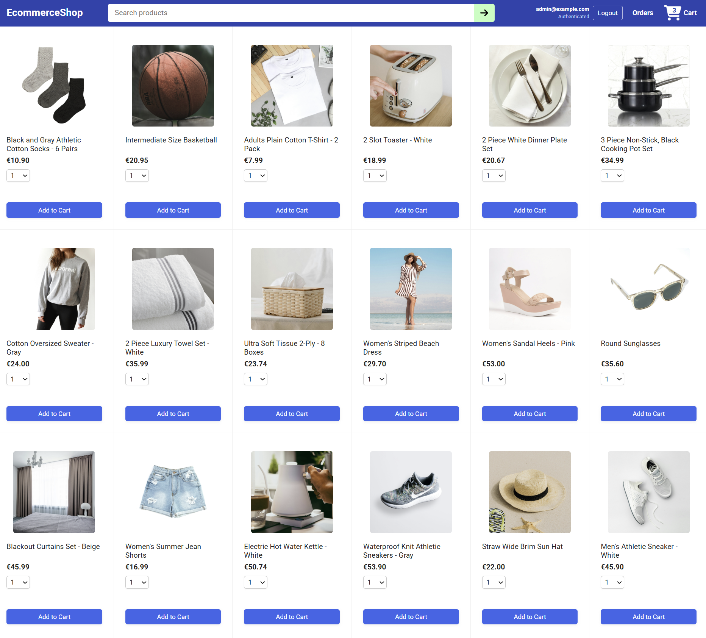

# 🛒 EcommerceShop

A full-stack e-commerce application built with **Java, Spring Boot, Spring Security, React, and TypeScript**.

The application provides product browsing, user registration and authentication, shopping cart management, checkout, order history, and role-based administration. The backend exposes REST APIs using Spring Boot and Spring Data JPA, while the React frontend communicates with the API through Axios.

---

## Screenshot



## ✨ Key Features

- User registration and authentication
- Product catalog
- Shopping cart management
- Checkout and order creation
- User order history
- Admin product management
- Admin user management
- Admin order management
- Role-based access for users and administrators
- Persistent H2 database
- REST API

---

## 🛠 Tech Stack

### Backend

- Java
- Spring Boot
- Spring MVC
- Spring Security
- Spring Data JPA
- REST APIs
- Maven

### Frontend

- React
- TypeScript
- Vite
- React Router
- Axios
- HTML / CSS

### Database

- H2 file database

### Security

- Spring Security
- HTTP Basic authentication
- Role-based authorization

---

## 📁 Project Structure

```text
EcommerceShop/
├── backend/     # Spring Boot REST API
├── frontend/    # React / TypeScript frontend
└── data/        # Local H2 database files
```

---

## 🔌 Backend API

The Spring Boot backend exposes REST endpoints under `/api`.

### Main Controllers

- **UserController** — user registration and admin user management
- **ProductController** — public product catalog and admin product management
- **CartController** — authenticated shopping cart operations
- **OrderController** — checkout, order history, and admin order management
- **AuthController** — information about the currently authenticated user

### User Endpoints

`UserController` is mapped under `/api`.

| Method | Endpoint | Access | Description |
| --- | --- | --- | --- |
| `POST` | `/api/public/users` | Public | Register a new user |
| `GET` | `/api/admin/users` | Admin | Get all users |
| `GET` | `/api/admin/users/{userId}` | Admin | Get one user |
| `PUT` | `/api/admin/users/{userId}` | Admin | Update a user |
| `DELETE` | `/api/admin/users/{userId}` | Admin | Delete a user |

---

## 🔗 Frontend & Backend Integration

The React frontend communicates with the Spring Boot REST API through Axios.

The Axios client is configured in:

```text
frontend/src/api/ecommerceApi.ts
```

```ts
const api = axios.create({
    baseURL: import.meta.env.VITE_API_URL ?? '/api',
    withCredentials: true,
});
```

During development, Vite proxies `/api` requests to the Spring Boot backend:

```ts
server: {
  proxy: {
    '/api': {
      target: 'http://localhost:8080'
    }
  }
}
```

For example:

```ts
api.post('/public/users', request)
```

is sent to:

```text
http://localhost:8080/api/public/users
```

This keeps API calls simple on the frontend while allowing the frontend and backend to run on separate development servers.

---

## 🔐 Authentication & Authorization

The application uses **Spring Security with HTTP Basic authentication** and role-based authorization.

Access is divided into three areas:

- **Public endpoints** — registration and product browsing
- **Authenticated user endpoints** — cart management, checkout, order history, and current-user information
- **Admin endpoints** — user, product, and order administration

Backend routes are protected according to their required access level:

- `/api/public/**` — public access
- `/api/users/**`, `/api/orders/**`, `/api/auth/me` — authenticated users
- `/api/admin/**` — administrators

For this demo application, the frontend stores the Basic Authentication header in browser storage and includes it with protected API requests.

> **Security note:** This authentication approach is intended for demonstration purposes. A production version should use a more robust authentication strategy and avoid storing reusable authentication credentials in browser storage.

### Admin Configuration

Admin credentials can be configured through environment variables:

```text
ADMIN_USERNAME=admin@example.com
ADMIN_PASSWORD=your-password
```

When `ADMIN_PASSWORD` is configured, the backend seeds or updates the administrator account during application startup.

---

## 🗄 Database

The backend uses **Spring Data JPA** for persistence and an **H2 file database** for local data storage.

The application persists data related to:

- Users and roles
- Products
- Shopping carts and cart items
- Orders and order items

The database is configured in:

```text
backend/src/main/resources/application.properties
```

with:

```properties
spring.datasource.url=jdbc:h2:file:./data/ecommerce;DB_CLOSE_ON_EXIT=FALSE;AUTO_RECONNECT=TRUE
```

Products are automatically seeded during application startup by `DataSeeder`.

The H2 console is disabled by default and can be enabled for local development with:

```text
H2_CONSOLE_ENABLED=true
```

---

## 🧪 Testing

The backend includes automated tests using **JUnit 5** and **Mockito**.

Current test coverage includes:

- **ProductServiceImplUnitTests** — unit tests for product service logic
- **UserServiceImplUnitTests** — unit tests for user service logic
- **BackendApplicationTests** — verifies that the Spring application context loads successfully

Run all backend tests with:

```bash
cd backend
mvn test
```

The frontend can be type-checked and built with:

```bash
cd frontend
npm run build
```

Frontend component and end-to-end tests are not currently included.

---

## 📋 Prerequisites

Make sure the following tools are installed:

- Java 25
- Maven
- Node.js
- npm

You can verify the installations with:

```bash
java -version
mvn -version
node -v
npm -v
```

---

## 🚀 Run Locally

The frontend and backend run separately during local development.

### 1. Start the Backend

Open a terminal in the project directory:

```bash
cd backend
mvn spring-boot:run
```

The Spring Boot API will be available at:

```text
http://localhost:8080
```

Keep this terminal running.

### 2. Start the Frontend

Open another terminal:

```bash
cd frontend
npm install
npm run dev
```

The React application will be available at:

```text
http://localhost:5173
```

---

## 🛒 Main User Flow

A typical user can:

1. Open the application.
2. Register a new account.
3. Sign in with an email address and password.
4. Browse the product catalog.
5. Add products to the shopping cart.
6. Manage cart quantities.
7. Complete checkout.
8. View previous orders.

Administrators additionally have access to management functionality for users, products, and orders.

---

## 👨‍💻 Author

**Marius Cretu**  
Java Full-Stack Developer

[Portfolio](https://cremarnic.github.io/Portfolio/) · [GitHub](https://github.com/CreMarNic) · [LinkedIn](https://www.linkedin.com/in/marius14cretu)
